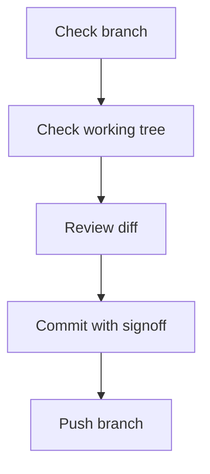

# Git Status Quick Check

## Visual Map



## Quick Commands

```bash
git status
git diff
git add .
git commit -s -m "message"
git push origin <branch>
```

## Purpose

This document provides a quick reference for checking repository status before creating commits and pull requests.