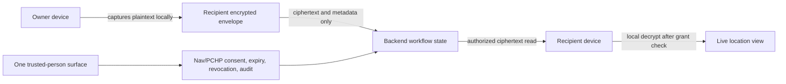

# One Location Agent

Status: v1 implementation contract
Owner: One + IAM/consent governance
Last updated: 2026-06-18

## Visual Map



## Current Truth

Merged KAI location APIs are a prototype/current-risk surface. They include a
public shared resolver and server-readable latest coordinate rows. They are not
the One Location Agent architecture and should not receive more product entry
points.

The production direction is One-owned. Authenticated recipient-scoped live
location remains ciphertext-only. Owner-created public location links are a
separate, explicit, duration-bounded snapshot-sharing mode.

## Plaintext Boundary

Plain coordinates are allowed only on:

- the owner's device while capturing foreground location
- the approved recipient's device after local decryption
- `one_location_public_invites.metadata.publicLocation` when the owner
  explicitly creates a snapshot-backed public location link
- public invite resolve responses when the owner explicitly attached a captured
  `publicLocation` snapshot to a public link

Plain coordinates are forbidden in:

- backend database rows outside the explicit public invite snapshot field
- backend API responses outside snapshot-backed public invite resolve
- logs and analytics
- notification payloads
- consent/audit metadata
- public URLs themselves
- support tooling and server fallback buffers

Public links may store one sanitized `publicLocation` snapshot in invite
metadata only when created through the explicit public location flow. That
snapshot is returned by token resolve while the invite is active. It is not a
live grant, ciphertext envelope, movement trail, raw owner identity, address, or
reverse-geocoded enrichment.

## Ciphertext Envelope

The web/native client creates one envelope per grant update:

```json
{
  "algorithm": "ECDH-P256-AES256-GCM",
  "recipientKeyId": "recipient-key-id",
  "ciphertext": "base64url-aes-gcm-ciphertext",
  "iv": "base64url-96-bit-iv",
  "senderEphemeralPublicKeyJwk": {},
  "capturedAt": "2026-05-20T00:00:00.000Z",
  "sourcePlatform": "web|ios|android|native",
  "metadata": { "payload": "coordinate_envelope", "plaintext": false }
}
```

The backend stores the envelope and grant metadata only. It does not parse,
reverse geocode, map, notify, or inspect latitude/longitude.

## Key Contract

- Recipients register an active ECDH P-256 public JWK.
- Recipient private keys remain in client-side device storage.
- Owners encrypt with an ephemeral ECDH P-256 key and AES-GCM 256.
- Grant rows are bound to `owner_user_id`, `recipient_user_id`, and
  `recipient_key_id`.
- If recipient key material is unavailable or rotated away from the grant key,
  the owner must create a fresh grant.

## Authorization Contract

All live-location grant, envelope, approval, revocation, and state routes
require a VAULT_OWNER bearer token. Public invite routes are the only public
exceptions. Request-only invites resolve safe owner/link metadata and accept
visitor name/phone/message. Snapshot-backed public location invites resolve safe
owner/link metadata plus the attached public location snapshot.

- `actor_identity_cache.phone_verified = true` is eligibility only.
- Each recipient needs a separate active grant.
- Expiry and revocation block reads before ciphertext is returned.
- Referrals create access requests only; they never forward access.
- Request-only public invite submissions create access requests only when the visitor maps
  to a verified Hussh user with active recipient key material; otherwise they
  remain metadata-only intent for follow-up.
- Snapshot-backed public invite resolves do not create grants, requests, or
  recipient-scoped access. Anyone with the active token can view the attached
  public snapshot until expiry or revocation.
- Invite to One links are hash-only onboarding links. A signed-in visitor must
  complete the normal phone verification gate and unlock their own vault so the
  client can bootstrap only that visitor's One Location recipient key. Claiming
  creates a metadata-only mutual One Network connection; it never creates a live
  location grant, exposes private owner profile data, or requests location
  permission.
- Consent/audit records are metadata-only.

Capability scopes:

- `cap.location.live.share`
- `cap.location.live.view`
- `cap.location.live.request`
- `cap.location.live.revoke`
- `cap.location.live.refer_request`

## Agent And Tool Contract

`hushh_mcp.agents.location` is the One Location Agent surface. The manifest
declares callable ADK tools for recipient listing, grant creation, encrypted
envelope publishing, ciphertext viewing, revocation, access requests, request
resolution, and referrals. Tools validate their capability scope per invocation
and delegate persistence to `OneLocationAgentService`.

The agent refuses referrals or public submissions that grant private access
without owner approval. Public bearer links may reveal only the explicit
owner-attached public snapshot, never private grants, ciphertext, movement
trails, raw tokens, or raw owner identity.

## Public Links

Public sharing has two modes: snapshot-backed public location links and legacy
request-only links.

1. The authenticated owner creates a duration-bounded public link from
   `/one/location`.
2. The backend returns the raw token once and stores only its hash.
3. If the owner attached a `publicLocation` snapshot, the public resolve
   response returns safe owner/link metadata plus that snapshot. The public page
   displays the map immediately with no name, phone, or message form.
4. If no snapshot is attached, the link is request-only and the public resolve
   response exposes only a safe owner label, status, duration, and expiry. By
   default the safe label is "a trusted person".
5. Request-only public links may submit metadata only. They do not display a map
   or location.
6. If the phone maps to a verified/keyed Hussh user in a request-only flow, One creates a normal
   pending access request for owner approval.
7. If the phone does not have usable Hussh identity/key material, the submission
   stays pending identity/key setup.
8. Owner approval still creates a fresh recipient-scoped grant and the owner
   device still encrypts the coordinate envelope for that recipient.

Public invite tables store token hashes, status, expiry, visitor display name,
phone hash/last4, matched user id when available, request linkage, and an
optional sanitized public location snapshot for snapshot-backed links. They must
not store raw phone numbers, raw invite tokens, addresses, map previews, or
movement/freshness trails. Public submissions are bounded per token, throttled
per phone/fingerprint hash, and never return request internals, grants, or
ciphertext to the anonymous caller.

## KAI Circle Recommendation Contract

Phase 5 KAI Circle improves the authenticated recipient directory ranking. The
service may use existing One Location sharing history, pending requests,
referrals, mutual KAI graph proximity, prior consent approvals,
advisor/investor relationship proximity, active relationship-share grants,
same-organization RIA firm membership, discoverable marketplace profiles,
shared public marketplace categories/interests, and runtime persona state as
safe recommendation signals.

Recommendation metadata can include category, tier, score, short reason labels,
public profile headline, verification badge, and last interaction timestamp. It
does not create access, replace consent, or expose coordinates, raw phone
numbers, invite tokens, grant ids, request ids, raw consent scopes, ciphertext,
or PKM payloads. Missing optional marketplace, relationship, consent, persona,
or organization tables must degrade to cold-start location-ready
recommendations instead of failing the location state API.

## Notification Contract

Location notifications are best-effort and metadata-only. Payloads may include
safe ids, actor ids, action type, expiry/countdown metadata, and `/one/location`
navigation. They must not include coordinates, addresses, map previews,
freshness trails, ciphertext, token values, or debug terminology.

## Retention Contract

Expired or revoked One Location work is short-lived. Terminal grants, their
ciphertext envelopes, terminal access requests, referrals, and related
metadata-only events are retained for at most 12 hours after expiry or
revocation, then purged from the database. The runtime runs opportunistic
cleanup during state/read flows, and hosted environments may call
`POST /api/one/location/retention/purge?older_than_hours=12` with
`X-Hushh-Maintenance-Token` backed by the dedicated
`ONE_LOCATION_RETENTION_TOKEN` for scheduled cleanup. Public request-link
invites, public submissions, and Invite to One links follow the same terminal-state
retention boundary.

## Native Contract

v1 is foreground-only.

- iOS uses `NSLocationWhenInUseUsageDescription` and the `HushhLocation`
  Capacitor plugin.
- Android uses fine/coarse location permissions and the `HushhLocation`
  Capacitor plugin.
- No iOS background location mode is added.
- No Android background location permission is added.

Denied, unavailable, approximate, and foreground-only states must be visible in
the web control surface.

## Migration From KAI Prototype

The legacy KAI location prototype (`kai_location_*` tables, migration 060) has
been fully decommissioned. Its plaintext `kai_location_latest` table stored raw
coordinates at rest, violating the zero-knowledge invariant.

1. The prototype tables were dropped in migration
   `069_drop_kai_location_plaintext.sql` (children before parents, idempotent).
2. The unmounted KAI location router and `KaiLocationService` were removed.
3. The One Location Agent (`one_location_*`) is now the only live-location
   system; updates are stored only as ciphertext in `one_location_envelopes`.
4. Account-deletion cleanup no longer references the dropped tables.

## Test Bar

The implementation must prove:

- verified directory excludes self and unverified users
- backend never returns plaintext coordinates
- encrypted envelopes are recipient-bound
- non-recipient reads fail
- expired/revoked grants block reads
- referrals create requests but no access
- notification and audit metadata contain no coordinates
- public links store token hashes only; snapshot-backed links reveal only the
  explicit public snapshot, while request-only links never reveal location
- web, iOS, and Android have foreground permission parity
- A/B/C/D flow is covered at service, authenticated API route, and browser
  crypto levels
