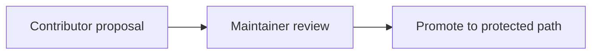

# CI and Deploy Proposals

## Visual Map

Contributor pull requests cannot modify protected pipeline surfaces
(`.github/workflows/`, `deploy/`, `scripts/ci/`, and related paths). Proposals
land here so maintainers can promote them into the sealed surfaces.

## Promotion path

1. Contributor opens a PR with the proposal file and any local runner script
   under `scripts/ops/`.
2. Maintainers review the proposal and, if accepted, copy it into the protected
   path in a maintainer-owned commit.
3. The contributor PR can close as superseded once the promoted workflow or
   deploy config reaches `integration/pr-train` or `main`.

See [CI governance](../ci.md#protected-pipeline-surfaces) and
[branch governance](../branch-governance.md).
