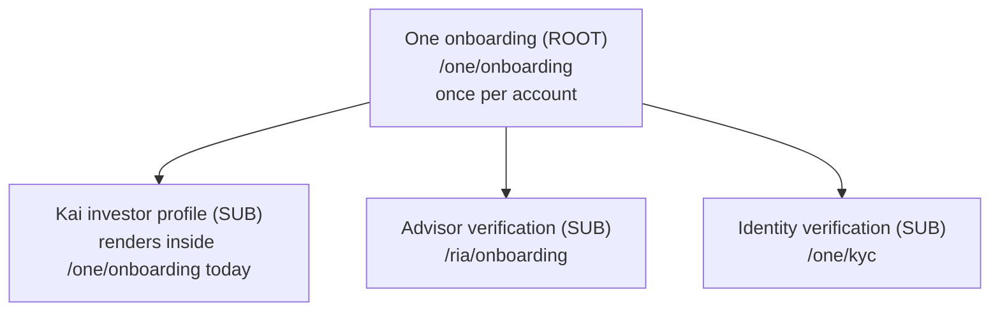

# One Onboarding Architecture — One first, sub‑onboardings downstream

Status: canonical reference. Source of truth for how onboarding is structured,
gated, reset, resumed, and skipped across the app.

> This is **not** Kai‑specific. The app has **one** account‑level onboarding
> (the "One" gate) that runs once per account, plus several **sub‑onboardings**
> that live downstream under One (Kai investor profile, RIA advisor
> verification, KYC). The model mirrors the agent / sub‑agent hierarchy: One is
> the orchestrator above every surface, and each surface owns its own
> onboarding the way each sub‑agent owns its own job.

## 1. The hierarchy

The hierarchy is declared once in
[`lib/navigation/onboarding-registry.ts`](../../../hushh-webapp/lib/navigation/onboarding-registry.ts).
Guards, reset flows, chrome, and this doc all read from that registry so the
shape can never silently drift. **Never hand‑roll onboarding gating outside the
registry — add or extend an `OnboardingDefinition` instead.**

| Flow | Tier | Route | Reset scope | Resumable | Skippable |
| --- | --- | --- | --- | --- | --- |
| One | `root` | `/one/onboarding` | `account` | yes | yes |
| Kai investor profile | `sub` | `/one/onboarding` (shared today) | `surface` | yes | yes |
| Advisor verification (RIA) | `sub` | `/ria/onboarding` | `surface` | yes | no |
| Identity verification (KYC) | `sub` | `/one/kyc` | `surface` | no | no |

Note on Kai: the investor‑profile wizard currently renders **inside** the One
root route (`/one/onboarding`), which is why `routes.ts` aliases
`isKaiOnboardingRoute = isOneOnboardingRoute` and `buildKaiOnboardingRoute =
buildOneOnboardingRoute`. The canonical names are the `one*` ones; the `kai*`
aliases are retained only for back‑compat. Treat Kai as a sub‑onboarding that
happens to share the One route, not as a second account gate.

## 2. Who gates onboarding (and who does not)

- `proxy.ts` (Next 16 — **not** `middleware.ts`) does **not** gate onboarding.
  It only performs legacy route redirects and passes everything else through.
  It cannot read the client onboarding cookies, by design.
- Client guards are authoritative: `OneOnboardingGuard`
  (`components/kai/onboarding/kai-onboarding-guard.tsx`), `VaultLockGuard`, and
  `PostAuthRouteService` read the **stores**, not stale cookies, to decide
  whether to send the user to onboarding.

## 3. State stores, in trust order

The One root resolves completion from these stores; the first that answers wins:

1. **Server pre‑vault state** (`PreVaultUserStateService`) — authoritative for
   users with no vault or a locked vault. `preOnboardingCompleted === true`
   means the One gate is satisfied.
2. **Vault profile** (`KaiProfileService`) — authoritative once the vault is
   unlocked.
3. **Local Preferences + localStorage** (`PreVaultOnboardingService`) —
   offline / native bridge; mirrored up to the server when connectivity returns.
4. **Session hint** (`sessionStorage`) — per‑tab fast‑path cache only; never
   authoritative.

### Deprecated: `kai_onboarding_required` cookie

`kai_onboarding_required` is a client‑only cookie with **no reader** — it is
dead state retained only because two contract tests assert its presence. Do not
build new gating on it. The live cookie is `kai_onboarding_flow_active` (read by
`kai-chrome-state` and `AuthStep` to route to the import step after Continue).
See the deprecation note in
[`lib/services/onboarding-route-cookie.ts`](../../../hushh-webapp/lib/services/onboarding-route-cookie.ts).

## 4. Lifecycle semantics

### Complete / Skip the One gate

Both Continue (`onLaunchDashboard`) and Skip (`completeSetupAsSkipped`) in
[`app/one/onboarding/page.tsx`](../../../hushh-webapp/app/one/onboarding/page.tsx)
write the authoritative store first, **await** the server pre‑vault sync before
navigating (so the gate is server‑authoritative the instant the user leaves —
this closed a prior fire‑and‑forget race), then redirect. Skip marks the flow
"satisfied for now": the user is not bounced back, but the flow can be re‑run.

### Reset / come back to onboarding

`handleResetAccount` in
[`app/profile/page.tsx`](../../../hushh-webapp/app/profile/page.tsx) keeps the
identity and vault but returns the account to a just‑onboarded state: it calls
`AccountService.resetAccount` (clears the authoritative pre‑vault completion),
clears local + cache state, re‑arms onboarding, and redirects to
`/one/onboarding`. Because the server store is cleared, the One root gate
genuinely reappears — and **only** after an explicit reset or account delete.

### Resume gracefully

Re‑entering a half‑finished flow restores the last saved draft + step from its
draft store (`PreVaultOnboardingService.saveDraft` for One/Kai;
`RiaOnboardingDraft` for RIA). Resumable flows are marked `resumable: true` in
the registry.

### Skip and come back

A skipped sub‑onboarding stays re‑enterable from its own surface independently of
the One gate. Completing or skipping a sub‑onboarding never re‑locks the One
gate, and a satisfied One gate never force‑completes a sub‑onboarding.

## 5. Rules for contributors

1. Model every new onboarding as an `OnboardingDefinition` in the registry.
2. One is the only `account`‑scoped gate. Everything else is `surface`‑scoped.
3. Read the authoritative store; never gate on the dead `required` cookie.
4. Await any server completion sync before navigating away from a flow.
5. Keep the `one*` route helpers canonical; `kai*` helpers are deprecated
   aliases.
