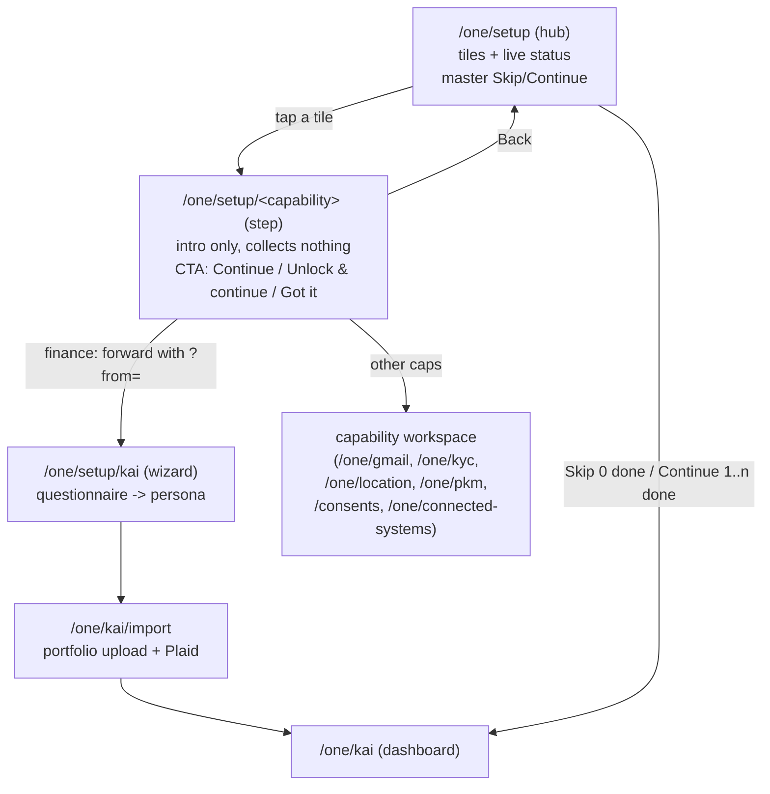
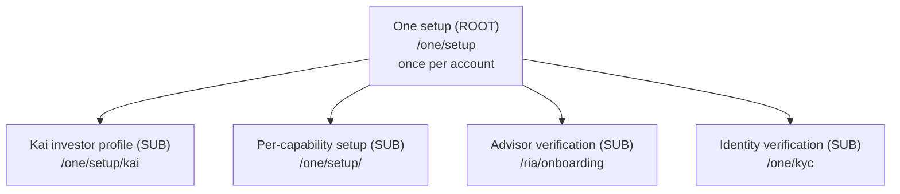

# One Setup Architecture — One first, sub‑setups downstream

Status: canonical reference. Source of truth for how setup is structured,
gated, reset, resumed, and skipped across the app.

> Naming: the account‑level flow and its surfaces are now called **setup**
> (formerly "onboarding"). The canonical routes are `/one/setup` (hub),
> `/one/setup/kai` (Kai investor‑profile wizard), and `/one/setup/<capability>`
> (per‑capability steps). Persisted state uses `setup_*` / `nav_setup_*`
> columns and the `hushh_setup_*` cookies. Some internal symbol names still
> read `onboarding` for back‑compat; the user‑facing surface and routes are
> "setup".

> This is **not** Kai‑specific. The app has **one** account‑level setup
> (the "One" gate) that runs once per account, plus several **sub‑setups**
> that live downstream under One (Kai investor profile, RIA advisor
> verification, KYC). The model mirrors the agent / sub‑agent hierarchy: One is
> the orchestrator above every surface, and each surface owns its own
> setup the way each sub‑agent owns its own job.

## Visual Map

The end‑to‑end curated setup journey, from the hub through a per‑capability
step into the capability's real workspace. Vault‑backed capabilities collect
nothing at the step (they render pre‑vault) and forward to a destination that
owns its own unlock prompt; the step only sets the honest "you'll unlock next"
expectation.

Capability classification (single source of truth:
[`lib/onboarding/one-capabilities.ts`](../../../hushh-webapp/lib/onboarding/one-capabilities.ts)):

| Capability | Kind | Destination | Vault |
| --- | --- | --- | --- |
| Finance | wizard | `/one/setup/kai` → `/one/kai/import` | `requiresVault` |
| Gmail | OAuth | `/one/gmail` | `requiresVault` |
| Email | workflow | `/one/kyc` | `requiresVault` |
| Location | workflow | `/one/location` | `requiresVault` |
| Personal Data | workflow | `/one/pkm` | `requiresVault` |
| Consent Guardian | explore‑only | `/consents?tab=pending` | none |
| Connected Systems | OAuth | `/one/connected-systems` | `requiresVault` |

Only **Consent Guardian** is explore‑only (it collects nothing and is "set up"
by looking once). Every other capability is a real workspace that reads
vault‑backed data, so a `completed` status reads "Ready" (not "Explored") and a
locked vault surfaces an honest "Unlock to see" / "Unlock & continue".

## 1. The hierarchy

The hierarchy is declared once in
[`lib/navigation/onboarding-registry.ts`](../../../hushh-webapp/lib/navigation/onboarding-registry.ts).
Guards, reset flows, chrome, and this doc all read from that registry so the
shape can never silently drift. **Never hand‑roll setup gating outside the
registry — add or extend an `OnboardingDefinition` instead.**

| Flow | Tier | Route | Reset scope | Resumable | Skippable |
| --- | --- | --- | --- | --- | --- |
| One (setup hub) | `root` | `/one/setup` | `account` | yes | yes |
| Kai investor profile | `sub` | `/one/setup/kai` | `surface` | yes | yes |
| Per‑capability setup | `sub` | `/one/setup/<capability>` | `surface` | yes | yes |
| Advisor verification (RIA) | `sub` | `/ria/onboarding` | `surface` | yes | no |
| Identity verification (KYC) | `sub` | `/one/kyc` | `surface` | no | no |

Note on routes: `/one/setup` is the hub and resolves the **master** account
gate via its own Skip (when 0 capabilities are set up) / Continue (when 1..n are
set up) buttons. `/one/setup/kai` is the standalone Kai investor‑profile
wizard. `/one/setup/<capability>` steps are reached by first‑clicking a
capability tile; they record only that capability's signal and never write the
master account gate. Legacy `/one/onboarding` is removed (404); the legacy
`/kai/onboarding` and `/one/kai/onboarding` deep links 307‑redirect to
`/one/setup/kai`. `routes.ts` keeps `KAI_SETUP` pointing at `/one/setup/kai`
and the `isOneSetup*` predicates as canonical; older `*Onboarding*` symbol
names that remain are back‑compat aliases.

## 2. Who gates onboarding (and who does not)

- `proxy.ts` (Next 16 — **not** `middleware.ts`) does **not** gate setup.
  It only performs legacy route redirects (`/one/onboarding` family →
  `/one/setup/kai`) and passes everything else through. It cannot read the
  client setup cookies, by design.
- Client guards are authoritative: `OneOnboardingGuard`
  (`components/kai/onboarding/kai-onboarding-guard.tsx`), `VaultLockGuard`, and
  `PostAuthRouteService` read the **stores**, not stale cookies, to decide
  whether to send the user to setup.

## 3. State stores, in trust order

The One root resolves completion from these stores; the first that answers wins:

1. **Server pre‑vault state** (`PreVaultUserStateService`) — authoritative for
   users with no vault or a locked vault. `setupCompleted === true` (persisted
   as the `setup_completed` column) means the One gate is satisfied.
2. **Vault profile** (`KaiProfileService`) — authoritative once the vault is
   unlocked.
3. **Local Preferences + localStorage** (`PreVaultOnboardingService`) —
   offline / native bridge; mirrored up to the server when connectivity returns.
4. **Session hint** (`sessionStorage`) — per‑tab fast‑path cache only; never
   authoritative.

### Cookies: `hushh_setup_*`

The client setup cookies are `hushh_setup_required`, `hushh_setup_flow_active`,
and `hushh_setup_complete` (renamed from the legacy `kai_onboarding_*` cookies).
`hushh_setup_required` is a client‑only cookie with **no reader** — it is dead
state retained only because contract tests assert its presence. Do not build
new gating on it. The live cookie is `hushh_setup_flow_active` (read by
`kai-chrome-state` and `AuthStep` to route to the import step after Continue).
See the note in
[`lib/services/onboarding-route-cookie.ts`](../../../hushh-webapp/lib/services/onboarding-route-cookie.ts)
(the file keeps its `onboarding-route-cookie` name; the cookie **values** are
`hushh_setup_*`).

## 4. Lifecycle semantics

### Complete / Skip the One gate

The master account gate is resolved on the **hub**
[`components/onboarding/setup/one-setup-hub.tsx`](../../../hushh-webapp/components/onboarding/setup/one-setup-hub.tsx)
via its own ack button: **Skip** when 0 capabilities are set up, **Continue**
when 1..n are. Both write the authoritative store first and **await** the
server pre‑vault sync before navigating (so the gate is server‑authoritative
the instant the user leaves — this closed a prior fire‑and‑forget race), then
redirect. Skip marks the flow "satisfied for now": the user is not bounced
back, but the flow can be re‑run. The Kai wizard at
[`app/one/setup/kai/page.tsx`](../../../hushh-webapp/app/one/setup/kai/page.tsx)
and per‑capability steps at
[`app/one/setup/[capability]/page.tsx`](../../../hushh-webapp/app/one/setup/%5Bcapability%5D/page.tsx)
record their own surface signal only; per‑capability steps never write the
master account gate.

### Per‑capability step → workspace handoff

Tapping a hub tile opens the shared per‑capability step
[`components/onboarding/setup/onboarding-capability-step.tsx`](../../../hushh-webapp/components/onboarding/setup/onboarding-capability-step.tsx).
The step is presentational and **collects nothing** — it renders pre‑vault and
forwards to the capability's real workspace via
`resolveCapabilityHandoffTarget` (declared in
[`lib/navigation/routes.ts`](../../../hushh-webapp/lib/navigation/routes.ts)).

The step renders a normal `AppPageShell`, so `/one/setup/[capability]` is a
**`standard`** route in
[`lib/navigation/app-route-layout.contract.json`](../../../hushh-webapp/lib/navigation/app-route-layout.contract.json)
— it inherits the app shell's top spacer (`--app-top-content-offset`, which
folds in `env(safe-area-inset-top)`) so its content always clears the top app
bar on notched devices. Only the self‑padding fullscreen wizard at
`/one/setup/kai` is a `flow` route. This is the layout‑level safe‑area
guarantee: step screens never hand‑roll top padding.

- **Finance** forwards to the investor‑preferences **wizard**
  (`/one/setup/kai`), not straight to the dashboard, so the questionnaire →
  persona → portfolio‑import journey is never orphaned. The forward appends a
  `?from=` marker so an already‑resolved user's visit is treated as an
  **intentional re‑entry**. Both the guard (`OneOnboardingGuard`) and the wizard
  page's own load effect honor this marker: without it, a resolved user tapping
  Finance dead‑looped back to `/one/setup` because the wizard page redirected
  resolved users to the hub. With it, the wizard renders pre‑filled from the
  saved profile / pre‑vault draft so the person can review or edit their answers.
- **Vault‑aware CTA**: capabilities flagged `requiresVault` in the catalog
  ([`lib/onboarding/one-capabilities.ts`](../../../hushh-webapp/lib/onboarding/one-capabilities.ts))
  whose vault is currently locked show **"Unlock & continue"** with a
  "you'll unlock your vault next" subline. The step still forwards; the
  destination guard owns the actual unlock prompt. The honest framing replaces
  the prior misleading "nothing to set up" copy on `email` and `location`,
  which are real vault‑gated workspaces, not explore‑only tabs.
- **Explore‑only** capabilities (only Consent Guardian) keep the "Got it" CTA;
  they are "set up" by looking once.

### Reset / come back to onboarding

`handleResetAccount` in
[`app/profile/page.tsx`](../../../hushh-webapp/app/profile/page.tsx) keeps the
identity and vault but returns the account to a just‑set‑up state: it calls
`AccountService.resetAccount` (clears the authoritative pre‑vault completion),
clears local + cache state, re‑arms setup, and redirects to
`/one/setup`. Because the server store is cleared, the One root gate
genuinely reappears — and **only** after an explicit reset or account delete.

### Resume gracefully

Re‑entering a half‑finished flow restores the last saved draft + step from its
draft store (`PreVaultOnboardingService.saveDraft` for One/Kai;
`RiaOnboardingDraft` for RIA). Resumable flows are marked `resumable: true` in
the registry.

### Skip and come back

A skipped sub‑onboarding stays re‑enterable from its own surface independently of
the One gate. Completing or skipping a sub‑onboarding never re‑locks the One
gate, and a satisfied One gate never force‑completes a sub‑onboarding.

## 5. Rules for contributors

1. Model every new setup flow as an `OnboardingDefinition` in the registry.
2. One is the only `account`‑scoped gate. Everything else is `surface`‑scoped.
3. Read the authoritative store; never gate on the dead `required` cookie.
4. Await any server completion sync before navigating away from a flow.
5. Keep the `isOneSetup*` route helpers and `/one/setup*` routes canonical;
   remaining `*Onboarding*` symbol names are back‑compat aliases.
6. Persist via `setup_*` / `nav_setup_*` columns and `hushh_setup_*` cookies;
   the KaiProfile blob uses `setup.*` keys (schema_version 3) with read‑compat
   for legacy `onboarding.*` / `nav_tour_*`.
